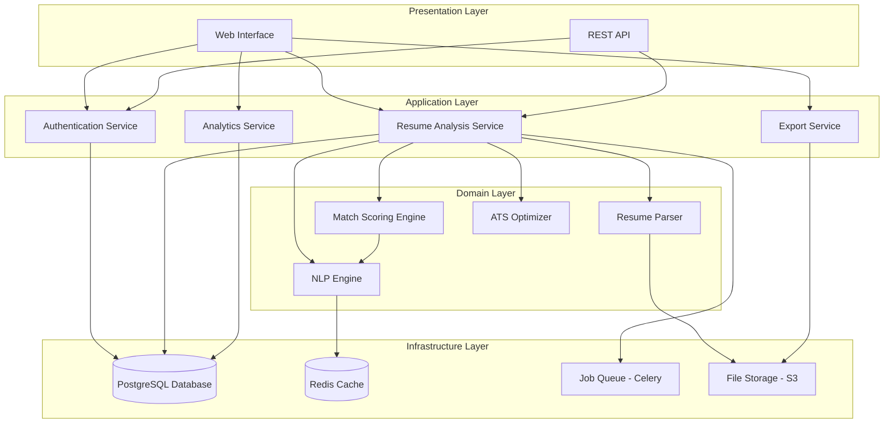
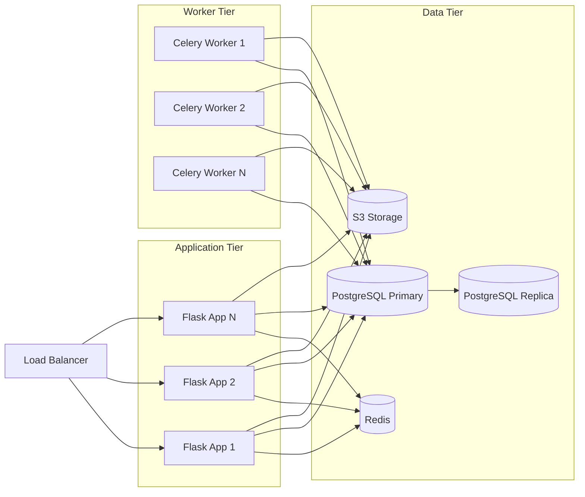

# Design Document: Resume Analyzer Redesign

## Overview

This design document specifies the architecture and implementation approach for transforming the AI Resume Analyzer from a basic Flask application into a production-ready SaaS platform. The system will provide enterprise-grade resume analysis with advanced NLP-based skill extraction, sophisticated match scoring, ATS optimization, user management, and comprehensive analytics.

### System Goals

- Provide accurate, AI-powered resume analysis with match scoring against job descriptions
- Extract and categorize skills using advanced NLP techniques
- Optimize resumes for Applicant Tracking Systems (ATS)
- Support multiple user tiers with usage-based limits
- Ensure enterprise-grade security and data privacy
- Scale to handle 100+ concurrent analyses
- Provide RESTful API for third-party integrations
- Deliver comprehensive analytics and insights

### Key Design Principles

1. **Security First**: All user data encrypted at rest and in transit, with comprehensive access controls
2. **Scalability**: Asynchronous processing, caching, and connection pooling for high throughput
3. **Modularity**: Clear separation between parsing, NLP, scoring, and presentation layers
4. **Testability**: Property-based testing for core algorithms, comprehensive unit tests for edge cases
5. **User Experience**: Real-time progress tracking, clear error messages, responsive interface

## Architecture

### High-Level Architecture

The system follows a layered architecture with clear separation of concerns:



### Technology Stack

**Backend Framework**: Flask 3.0+ with Flask-RESTful for API endpoints
- Mature, lightweight, extensive ecosystem
- Easy to test and deploy
- Strong community support

**Database**: PostgreSQL 15+
- ACID compliance for data integrity
- JSON support for flexible schema
- Excellent performance for complex queries
- Built-in full-text search capabilities

**Caching**: Redis 7+
- In-memory performance for frequently accessed data
- Session management
- Rate limiting support

**Task Queue**: Celery with Redis broker
- Asynchronous processing for NLP operations
- Retry logic and error handling
- Scalable worker architecture

**NLP Library**: spaCy 3.5+ with custom models
- Production-ready NLP pipelines
- Custom entity recognition for skills
- Fast inference performance
- Pre-trained models for English

**File Storage**: AWS S3 or compatible object storage
- Scalable file storage
- Built-in encryption
- Versioning support

**Authentication**: Flask-Login + JWT tokens
- Session management for web interface
- Token-based auth for API
- OAuth integration support

### Deployment Architecture



## Components and Interfaces

### 1. Authentication Service

**Responsibilities**:
- User registration and login
- Session management
- Password hashing and validation
- OAuth integration (Google, LinkedIn)
- API key generation and validation
- Password reset workflows

**Interface**:
```python
class AuthenticationService:
    def register_user(email: str, password: str) -> Result[User, AuthError]
    def login(email: str, password: str) -> Result[Session, AuthError]
    def validate_session(token: str) -> Result[User, AuthError]
    def reset_password(email: str) -> Result[None, AuthError]
    def oauth_login(provider: str, token: str) -> Result[Session, AuthError]
    def generate_api_key(user_id: int) -> str
    def validate_api_key(key: str) -> Result[User, AuthError]
```

**Security Requirements**:
- Passwords hashed with bcrypt (12+ rounds)
- Session tokens: JWT with 24-hour expiration
- API keys: 32-byte random strings, hashed in database
- Rate limiting: 5 failed login attempts per 15 minutes per IP

### 2. Resume Parser

**Responsibilities**:
- Extract text from PDF, DOCX, TXT files
- Identify and extract structured sections (contact, experience, education, certifications)
- Validate file format and size
- Malware scanning
- Preserve formatting metadata

**Interface**:
```python
class ResumeParser:
    def parse(file: UploadedFile) -> Result[ResumeData, ParseError]
    def validate_file(file: UploadedFile) -> Result[None, ValidationError]
    def extract_text(file: UploadedFile) -> Result[str, ParseError]
    def extract_sections(text: str) -> Result[ResumeSections, ParseError]
```

**Data Structures**:
```python
@dataclass
class ResumeData:
    contact_info: ContactInfo
    work_experience: List[WorkExperience]
    education: List[Education]
    certifications: List[Certification]
    raw_text: str
    metadata: FileMetadata

@dataclass
class ContactInfo:
    name: Optional[str]
    email: Optional[str]
    phone: Optional[str]
    location: Optional[str]

@dataclass
class WorkExperience:
    company: str
    title: str
    start_date: str
    end_date: Optional[str]
    description: str

@dataclass
class Education:
    institution: str
    degree: str
    field: str
    graduation_date: Optional[str]
```

**Parsing Strategy**:
- Use PyPDF2 for PDF text extraction
- Use python-docx for DOCX parsing
- Regex patterns for section identification
- Heuristic-based field extraction with confidence scores
- Fallback to ML-based section classification if regex fails

### 3. NLP Engine

**Responsibilities**:
- Extract skills from resume text
- Categorize skills into taxonomies
- Identify skill synonyms and variations
- Assign confidence scores
- Extract contextual information

**Interface**:
```python
class NLPEngine:
    def extract_skills(text: str) -> List[ExtractedSkill]
    def categorize_skill(skill: str) -> SkillCategory
    def find_synonyms(skill: str) -> List[str]
    def calculate_confidence(skill: str, context: str) -> float
```

**Data Structures**:
```python
@dataclass
class ExtractedSkill:
    name: str
    category: SkillCategory
    confidence: float  # 0-100
    context: str
    synonyms: List[str]

class SkillCategory(Enum):
    TECHNICAL = "technical"
    SOFT = "soft"
    DOMAIN = "domain"
    TOOLS = "tools"
    LANGUAGES = "languages"
```

**NLP Pipeline**:
1. **Tokenization**: spaCy tokenizer with custom rules
2. **Entity Recognition**: Custom NER model trained on skill entities
3. **Skill Matching**: Fuzzy matching against skill taxonomy database
4. **Contextual Analysis**: Sentence-level context for confidence scoring
5. **Synonym Resolution**: Map variations to canonical skill names

**Skill Taxonomy**:
- Maintain database of 10,000+ skills across categories
- Industry-specific skill lists (Technology, Healthcare, Finance, Marketing, Engineering)
- Regular updates from job posting analysis
- Synonym mappings (e.g., "JS" → "JavaScript", "ML" → "Machine Learning")

### 4. Match Scoring Engine

**Responsibilities**:
- Calculate match score between resume and job description
- Weight different factors appropriately
- Identify missing and extra skills
- Generate improvement recommendations
- Detect overqualification

**Interface**:
```python
class MatchScoringEngine:
    def calculate_match(resume: ResumeData, job_desc: str) -> MatchResult
    def identify_gaps(resume_skills: List[Skill], job_skills: List[Skill]) -> SkillGaps
    def generate_recommendations(match_result: MatchResult) -> List[Recommendation]
```

**Data Structures**:
```python
@dataclass
class MatchResult:
    overall_score: float  # 0-100
    required_skills_score: float
    preferred_skills_score: float
    experience_score: float
    education_score: float
    contextual_fit_score: float
    breakdown: ScoreBreakdown
    missing_skills: List[Skill]
    extra_skills: List[Skill]
    overqualified: bool

@dataclass
class ScoreBreakdown:
    required_skills_weight: float = 0.40
    preferred_skills_weight: float = 0.20
    experience_weight: float = 0.20
    education_weight: float = 0.10
    contextual_fit_weight: float = 0.10
```

**Scoring Algorithm**:

```
Overall Score = (
    Required Skills Score × 0.40 +
    Preferred Skills Score × 0.20 +
    Experience Score × 0.20 +
    Education Score × 0.10 +
    Contextual Fit Score × 0.10
)

Required Skills Score = (Matched Required Skills / Total Required Skills) × 100

Preferred Skills Score = (Matched Preferred Skills / Total Preferred Skills) × 100

Experience Score = min(100, (Resume Years / Required Years) × 100)
  - If Resume Years > Required Years × 1.5: Flag overqualification

Education Score:
  - Exact match: 100
  - Higher degree: 100
  - Lower degree: 70
  - No degree: 50 (if not required), 0 (if required)

Contextual Fit Score:
  - Industry keyword alignment
  - Company culture fit indicators
  - Role-specific terminology usage
```

### 5. ATS Optimizer

**Responsibilities**:
- Analyze resume for ATS compatibility
- Calculate keyword density
- Check formatting issues
- Generate optimization recommendations

**Interface**:
```python
class ATSOptimizer:
    def analyze_ats_compatibility(resume: ResumeData) -> ATSAnalysis
    def calculate_keyword_density(text: str, keywords: List[str]) -> Dict[str, float]
    def check_formatting(resume: ResumeData) -> List[FormattingIssue]
    def generate_ats_score(analysis: ATSAnalysis) -> float
```

**Data Structures**:
```python
@dataclass
class ATSAnalysis:
    ats_score: float  # 0-100
    keyword_densities: Dict[str, float]
    formatting_issues: List[FormattingIssue]
    recommendations: List[str]

@dataclass
class FormattingIssue:
    issue_type: str  # "table", "header", "footer", "font", "image"
    severity: str  # "high", "medium", "low"
    description: str
    location: str
```

**ATS Compatibility Checks**:
- No tables (ATS systems often can't parse them)
- No headers/footers (content may be ignored)
- Standard fonts (Arial, Calibri, Times New Roman)
- No images or graphics
- Clear section headers
- Consistent date formatting
- No text boxes or columns

**Keyword Density Calculation**:
```
Density = (Keyword Occurrences / Total Words) × 100

Optimal Range: 1-5%
- Below 1%: Recommend adding more context
- Above 5%: Warn about keyword stuffing
```

### 6. Resume Quality Scorer

**Responsibilities**:
- Calculate overall resume quality independent of job matching
- Evaluate completeness, clarity, formatting, content depth
- Identify common mistakes
- Validate chronological consistency

**Interface**:
```python
class ResumeQualityScorer:
    def calculate_quality_score(resume: ResumeData) -> QualityScore
    def check_completeness(resume: ResumeData) -> CompletenessScore
    def check_clarity(text: str) -> ClarityScore
    def check_formatting(resume: ResumeData) -> FormattingScore
    def check_content_depth(resume: ResumeData) -> ContentDepthScore
    def find_mistakes(resume: ResumeData) -> List[Mistake]
```

**Data Structures**:
```python
@dataclass
class QualityScore:
    overall_score: float  # 0-100
    completeness_score: float
    clarity_score: float
    formatting_score: float
    content_depth_score: float
    mistakes: List[Mistake]
    recommendations: List[str]

@dataclass
class Mistake:
    type: str  # "typo", "date_inconsistency", "vague_description"
    severity: str
    description: str
    location: str
```

**Quality Scoring Formula**:
```
Quality Score = (
    Completeness × 0.30 +
    Clarity × 0.25 +
    Formatting × 0.25 +
    Content Depth × 0.20
)

Completeness:
  - All sections present: 100
  - Missing optional sections: -10 per section
  - Missing required sections: -25 per section

Clarity:
  - Flesch Reading Ease score
  - Average sentence length
  - Active voice usage
  - Specific vs. vague language

Formatting:
  - Consistent date formats: +20
  - Clear section headers: +20
  - Appropriate length (1-2 pages): +20
  - Professional font and spacing: +20
  - Bullet points for lists: +20

Content Depth:
  - Quantified achievements: +25
  - Action verbs: +25
  - Specific technologies/tools: +25
  - Context and impact: +25
```

### 7. Analytics Service

**Responsibilities**:
- Aggregate user analysis data
- Calculate trends and benchmarks
- Generate visualizations
- Identify skill gaps and opportunities

**Interface**:
```python
class AnalyticsService:
    def get_user_analytics(user_id: int) -> UserAnalytics
    def calculate_trends(user_id: int) -> TrendData
    def get_skill_frequency(user_id: int) -> Dict[str, int]
    def get_industry_benchmarks(industry: str) -> BenchmarkData
```

**Data Structures**:
```python
@dataclass
class UserAnalytics:
    total_analyses: int
    average_match_score: float
    match_score_trend: List[Tuple[datetime, float]]
    top_skills: List[Tuple[str, int]]
    trending_missing_skills: List[str]
    industry_benchmarks: Optional[BenchmarkData]
```

### 8. Export Service

**Responsibilities**:
- Generate PDF reports
- Export JSON data
- Create optimized resume suggestions
- Handle bulk exports

**Interface**:
```python
class ExportService:
    def export_pdf_report(analysis: AnalysisResult) -> bytes
    def export_json(analysis: AnalysisResult) -> str
    def generate_optimized_resume(resume: ResumeData, recommendations: List[Recommendation]) -> bytes
    def bulk_export(user_id: int) -> bytes
```

### 9. Subscription Manager

**Responsibilities**:
- Track usage limits per tier
- Enforce tier restrictions
- Reset monthly counters
- Handle upgrades/downgrades

**Interface**:
```python
class SubscriptionManager:
    def check_usage_limit(user_id: int) -> Result[None, UsageLimitError]
    def increment_usage(user_id: int) -> None
    def get_usage_stats(user_id: int) -> UsageStats
    def reset_monthly_counters() -> None
```

**Data Structures**:
```python
class SubscriptionTier(Enum):
    FREE = "free"  # 5 analyses/month
    PROFESSIONAL = "professional"  # 50 analyses/month
    ENTERPRISE = "enterprise"  # unlimited

@dataclass
class UsageStats:
    tier: SubscriptionTier
    current_usage: int
    limit: Optional[int]
    reset_date: datetime
```

## Data Models

### Database Schema

```sql
-- Users table
CREATE TABLE users (
    id SERIAL PRIMARY KEY,
    email VARCHAR(255) UNIQUE NOT NULL,
    password_hash VARCHAR(255) NOT NULL,
    subscription_tier VARCHAR(50) NOT NULL DEFAULT 'free',
    created_at TIMESTAMP NOT NULL DEFAULT NOW(),
    updated_at TIMESTAMP NOT NULL DEFAULT NOW(),
    last_login TIMESTAMP,
    oauth_provider VARCHAR(50),
    oauth_id VARCHAR(255)
);

CREATE INDEX idx_users_email ON users(email);
CREATE INDEX idx_users_oauth ON users(oauth_provider, oauth_id);

-- API Keys table
CREATE TABLE api_keys (
    id SERIAL PRIMARY KEY,
    user_id INTEGER NOT NULL REFERENCES users(id) ON DELETE CASCADE,
    key_hash VARCHAR(255) NOT NULL,
    name VARCHAR(100),
    created_at TIMESTAMP NOT NULL DEFAULT NOW(),
    last_used TIMESTAMP,
    is_active BOOLEAN NOT NULL DEFAULT TRUE
);

CREATE INDEX idx_api_keys_user ON api_keys(user_id);
CREATE INDEX idx_api_keys_hash ON api_keys(key_hash);

-- Resumes table
CREATE TABLE resumes (
    id SERIAL PRIMARY KEY,
    user_id INTEGER NOT NULL REFERENCES users(id) ON DELETE CASCADE,
    file_name VARCHAR(255) NOT NULL,
    file_path VARCHAR(500) NOT NULL,
    file_size INTEGER NOT NULL,
    file_format VARCHAR(10) NOT NULL,
    uploaded_at TIMESTAMP NOT NULL DEFAULT NOW(),
    parsed_data JSONB NOT NULL,
    is_deleted BOOLEAN NOT NULL DEFAULT FALSE
);

CREATE INDEX idx_resumes_user ON resumes(user_id);
CREATE INDEX idx_resumes_uploaded ON resumes(uploaded_at);

-- Analyses table
CREATE TABLE analyses (
    id SERIAL PRIMARY KEY,
    user_id INTEGER NOT NULL REFERENCES users(id) ON DELETE CASCADE,
    resume_id INTEGER NOT NULL REFERENCES resumes(id) ON DELETE CASCADE,
    job_description TEXT NOT NULL,
    match_score FLOAT NOT NULL,
    ats_score FLOAT NOT NULL,
    quality_score FLOAT NOT NULL,
    extracted_skills JSONB NOT NULL,
    match_breakdown JSONB NOT NULL,
    recommendations JSONB NOT NULL,
    industry VARCHAR(100),
    created_at TIMESTAMP NOT NULL DEFAULT NOW()
);

CREATE INDEX idx_analyses_user ON analyses(user_id);
CREATE INDEX idx_analyses_resume ON analyses(resume_id);
CREATE INDEX idx_analyses_created ON analyses(created_at);
CREATE INDEX idx_analyses_match_score ON analyses(match_score);

-- Usage tracking table
CREATE TABLE usage_tracking (
    id SERIAL PRIMARY KEY,
    user_id INTEGER NOT NULL REFERENCES users(id) ON DELETE CASCADE,
    month DATE NOT NULL,
    analysis_count INTEGER NOT NULL DEFAULT 0,
    UNIQUE(user_id, month)
);

CREATE INDEX idx_usage_user_month ON usage_tracking(user_id, month);

-- Contact submissions table
CREATE TABLE contact_submissions (
    id SERIAL PRIMARY KEY,
    user_id INTEGER REFERENCES users(id) ON DELETE SET NULL,
    email VARCHAR(255) NOT NULL,
    subject VARCHAR(255) NOT NULL,
    message TEXT NOT NULL,
    category VARCHAR(50) NOT NULL,
    created_at TIMESTAMP NOT NULL DEFAULT NOW()
);

CREATE INDEX idx_contact_user ON contact_submissions(user_id);
CREATE INDEX idx_contact_created ON contact_submissions(created_at);

-- Skill taxonomy table
CREATE TABLE skill_taxonomy (
    id SERIAL PRIMARY KEY,
    skill_name VARCHAR(255) NOT NULL,
    canonical_name VARCHAR(255) NOT NULL,
    category VARCHAR(50) NOT NULL,
    industry VARCHAR(100),
    synonyms TEXT[],
    created_at TIMESTAMP NOT NULL DEFAULT NOW()
);

CREATE INDEX idx_skills_name ON skill_taxonomy(skill_name);
CREATE INDEX idx_skills_canonical ON skill_taxonomy(canonical_name);
CREATE INDEX idx_skills_category ON skill_taxonomy(category);
CREATE INDEX idx_skills_industry ON skill_taxonomy(industry);

-- Audit log table
CREATE TABLE audit_log (
    id SERIAL PRIMARY KEY,
    user_id INTEGER REFERENCES users(id) ON DELETE SET NULL,
    action VARCHAR(100) NOT NULL,
    resource_type VARCHAR(50) NOT NULL,
    resource_id INTEGER,
    ip_address INET,
    user_agent TEXT,
    created_at TIMESTAMP NOT NULL DEFAULT NOW()
);

CREATE INDEX idx_audit_user ON audit_log(user_id);
CREATE INDEX idx_audit_created ON audit_log(created_at);
CREATE INDEX idx_audit_action ON audit_log(action);
```

### Redis Cache Structure

```
# Session tokens
session:{token} -> {user_id, expires_at}
TTL: 24 hours

# Rate limiting
rate_limit:login:{ip} -> {attempt_count}
TTL: 15 minutes

rate_limit:api:{api_key} -> {request_count}
TTL: 1 hour

# Cached skill taxonomy
skills:category:{category} -> List[Skill]
TTL: 1 hour

skills:synonyms:{skill} -> List[str]
TTL: 1 hour

# Analysis results (temporary)
analysis:progress:{analysis_id} -> {stage, percentage}
TTL: 1 hour

# User analytics cache
analytics:user:{user_id} -> UserAnalytics
TTL: 5 minutes
```

### File Storage Structure

```
s3://resume-analyzer-bucket/
├── resumes/
│   └── {user_id}/
│       └── {resume_id}/
│           ├── original.{ext}
│           └── metadata.json
├── exports/
│   └── {user_id}/
│       └── {export_id}/
│           ├── report.pdf
│           └── data.json
└── temp/
    └── {upload_id}/
        └── {filename}
```

